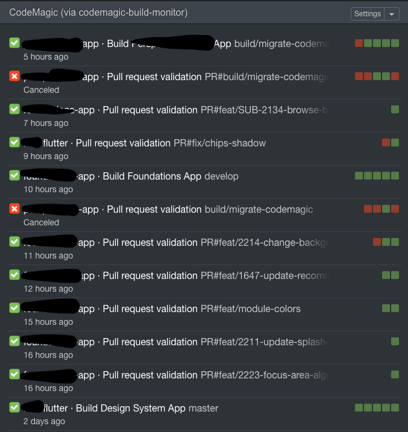
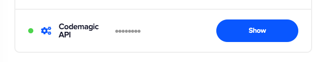
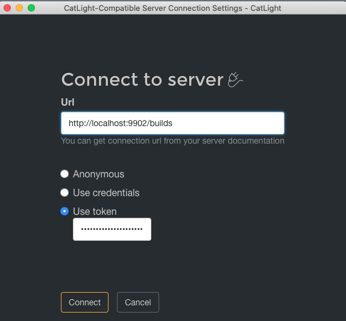
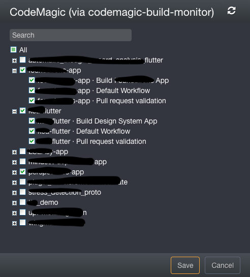

# codemagic-build-monitor

Adapter to give access to CodeMagic build status via the [CatLight Protocol](https://github.com/catlightio/catlight-protocol)



## How To

To use `codemagic-build-monitor` to monitor your CodeMagic workflows, follow these steps :

### 1. Start the "proxy" locally

```
docker run --name codemagic-build-monitor -d -p 9902:9902 --restart unless-stopped ghcr.io/tsimbalar/codemagic-build-monitor
```

Open `http://localhost:9902/` in a browser to check that the server is up and running.

### 2. Get your Access Token
- Go to your CodeMagic user settings at https://codemagic.io/settings
- Look for your CodeMagic API token




### 3. Connecting Catlight to `codemagic-build-monitor`

In CatLight, you need to :

1. Add new connection
2. choose "CatLight-compatible"
3. Log in with :

- Url : `http://localhost:9902/builds`
- "Use token"
- paste your token

4. Connect



### 4. Choose the workflows you want to track

1. Select the workflows you want to monitor
2. Connect



### 5. Profit

Get notified about new builds, failing builds etc


---

## Roadmap
